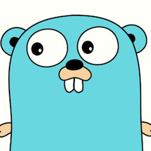

# 100DaysOfCode Log - Round 1 - Vitor Jr

The log of my #100DaysOfCode challenge. Started on 20220306.

## Log

### R1D0 - 20220306
**Today's Progress**: Defined what language I should learn that I could take more advantage: `golang`.

**Thoughts** [KodeKloud](https://kodekloud.com/) has amazing trainings for Docker, Kubernetes, Ansible, etc... with A LOT OF PRACTICE. And now they also have a [golang training](https://www.udemy.com/course/golang-for-beginners/).

**Link(s) to work**
1. I don't have a work... yet! Cause I'm planning what I'm going to start tomorrow, so... stay with Gopher!

---
### R1D1 - 20220307
**Today's Progress**: Had my first steps with `go`. The basic "Hello World" first program, how comments are done, the `main` function, data types, variables and scopes.

**Thoughts** I'm using [KodeKloud](https://kodekloud.com/). Bought a `go` training that they offer in [udemy](https://www.udemy.com/course/golang-for-beginners/). They have an amazing practice lab offer.

**Link(s) to work**
1. Got [this](https://go.dev/play/p/5tteqsEYh5E) example from the exercises. It shows a little about variables scope, about output format using `%.2f`, for example.
---

<!---
# 100 Days Of Code - Log

### Day 0: February 30, 2016 (Example 1)
##### (delete me or comment me out)

**Today's Progress**: Fixed CSS, worked on canvas functionality for the app.

**Thoughts:** I really struggled with CSS, but, overall, I feel like I am slowly getting better at it. Canvas is still new for me, but I managed to figure out some basic functionality.

**Link to work:** [Calculator App](http://www.example.com)

### Day 0: February 30, 2016 (Example 2)
##### (delete me or comment me out)

**Today's Progress**: Fixed CSS, worked on canvas functionality for the app.

**Thoughts**: I really struggled with CSS, but, overall, I feel like I am slowly getting better at it. Canvas is still new for me, but I managed to figure out some basic functionality.

**Link(s) to work**: [Calculator App](http://www.example.com)

### Day 0: 20220306

**Today's Progress**: Defined what language I should learn that I could take more advantage: `golang`.

**Thoughts** [KodeKloud](https://kodekloud.com/) has amazing trainings for Docker, Kubernetes, Ansible, etc... with A LOT OF PRACTICE. And now they also have a [golang training](https://www.udemy.com/course/golang-for-beginners/).

**Link(s) to work**
1. I don't have a work... yet! Cause I'm planning what I'm going to start tomorrow, so... stay with Gopher!

--->
